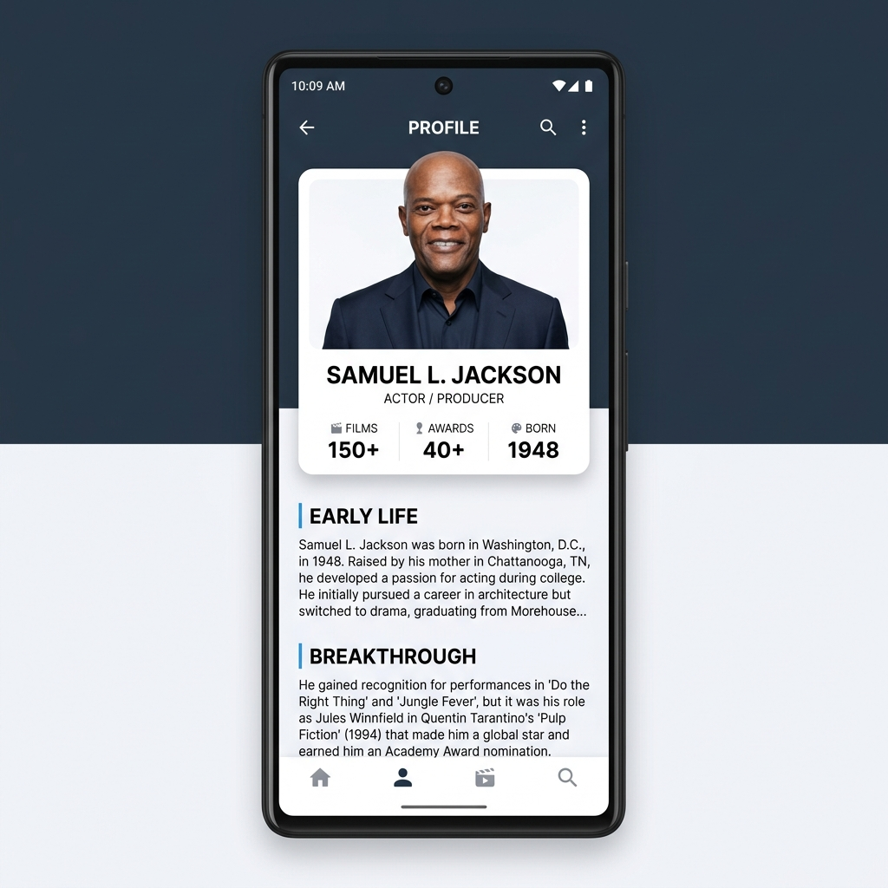

# Biografia: Samuel L. Jackson 🎭

Um aplicativo mobile moderno e elegante desenvolvido com **React Native** para exibir a biografia do lendário ator Samuel L. Jackson. O projeto foca em uma interface intuitiva, tipografia limpa e design profissional.



## ✨ Características

- **Design Premium**: Interface baseada em tons de azul ardósia e branco, com sombras suaves e bordas arredondadas.
- **Componentização**: Estrutura organizada com componentes reutilizáveis (`BarraTitulo`, `Card`, `Conteudo`).
- **Navegação Fluida**: Uso de `ScrollView` para uma leitura confortável.
- **Responsividade**: Layout adaptável para diferentes tamanhos de tela.

## 🚀 Tecnologias Utilizadas

- **React Native** (Core)
- **Expo** (Workflow)
- **StyleSheet** (CSS-in-JS para estilização profissional)

## 📁 Estrutura do Projeto

```text
biografia/
├── assets/             # Imagens e ícones do projeto
├── components/         # Componentes da interface
│   ├── BarraTitulo/    # Topo do aplicativo
│   ├── Card/           # Card de perfil com foto e estatísticas
│   └── Conteudo/       # Texto biográfico e detalhes
├── estilos.js          # Estilos globais do App
└── App.js              # Ponto de entrada do aplicativo
```

## 🛠️ Como rodar o projeto

1. **Instalar dependências**:
   ```bash
   npm install
   ```

2. **Iniciar o Expo**:
   ```bash
   npx expo start
   ```

3. **Visualizar no Celular**:
   Instale o app **Expo Go** no seu Android e escaneie o QR Code que aparecerá no seu terminal.

---
Desenvolvido com ❤️ como parte do aprendizado em React Native da DevMedia.
